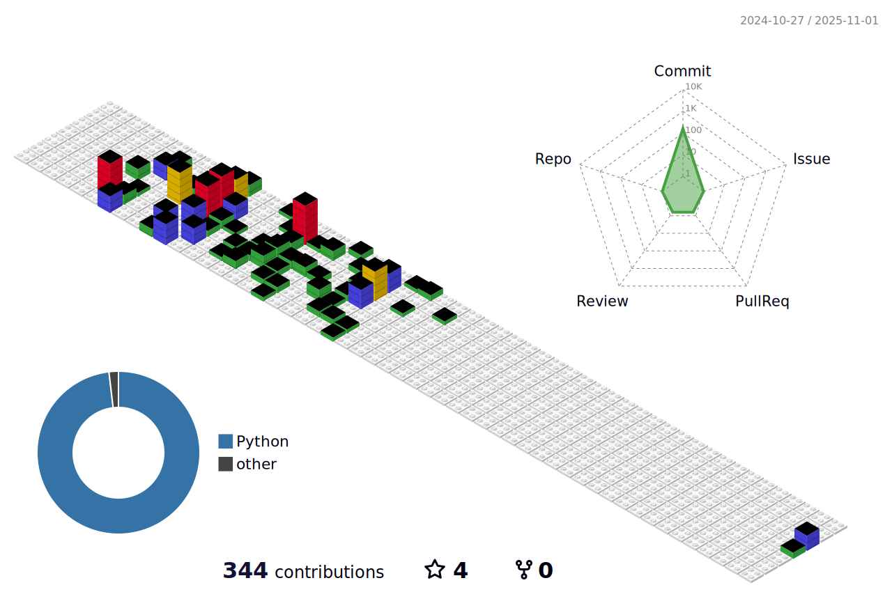
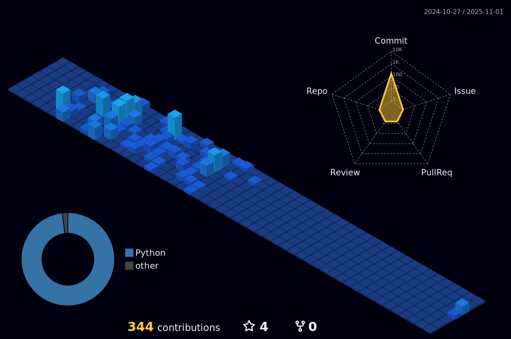

<!--  -->

#### 👋 HELLO

Thank you for visiting my GitHub page.

I am currently immersed in the study of data engineering and bring with me two years of experience as a numerical analysis developer. Beyond my focus on data engineering and quant development, I maintain a wide-ranging interest in various programming languages and theories. My goal is to discover improved solutions by exploring and mastering new technologies and tools.

I will be documenting my studies and challenges right here on my GitHub. Despite the prevalence of English among users, I've decided to primarily compose my posts in my native language, Korean. This choice is driven by my commitment to keeping my records concise and dedicating more time to the study of computer programming. If you ever find the need for English translations to understand my content, please do not hesitate to ask me for assistance.

As a developer who values opportunities for communication and sharing, I am excited about the prospect of growing and learning together. Please feel free to reach out at any time.

Best regards,  
SeminarNotes

#### 📚 CONTRIBUTIONS
<!--  
 
-->

#### 📚 STACKS
<!--
초기 stack 구성성

Programming Languages:
  

Python Libraries:
    

Frameworks:

Databases:
  

Container Engine:
 

Search Engine:

Operating System: 

-->

    <table>
        <tr>
            <td align="center">
                <b>Programming Language</b>
            </td>
            <td align="center">
                <b>IDE</b>
            </td>
            <td align="center">
                <b>Framework</b>
            </td>
            <td align="center">
                <b>Git</b>
            </td>
        </tr>
        <tr> 
            <td align="center">
                <b>
              
               
              
                </b>
            </td>
            <td align="center">
                
                <!-- 다른 IDE 아이콘들도 여기에 추가 -->
            </td>
            <td align="center">
                
            </td>
            <td align="center">
                
                
            </td>
        </tr>
        <tr>
            <td align="center">
                <b>DataBase</b>
            </td>
            <td align="center">
                <b>Docker</b>
            </td>
            <td align="center">
                <b>Python Library</b>
            </td>
            <td align="center">
                <b>Elastic Stack</b>
            </td>
        </tr>
        <tr> 
            <td align="center">
                <b>
                    
                     <a href="https://www.mathworks.com/" target="_blank" rel="noreferrer">
                     
                     
                      </a>
                </b>
            </td>
            <td align="center">
                
            </td>
            <td align="center">
                <b>
                 
                </b>
            </td>
            <td align="center">
                    
            </td>
        </tr>
        <tr>
            <td align="center">
                <b>ML Library</b>
            </td>
            <td  align="center">
                <b>Messaging</b>
            </td>
            <td  align="center">
                <b>Numercial Tool</b>
            </td>
            <td  align="center">
                <b>OS</b>
            </td>
            <!-- <td colspan="2" align="center">
                <b>Other Stacks</b>
            </td> -->
        </tr>
        <tr>
            <td align="center">
                
                
                 
                 
            </td>
            <td align="center">
             
            <td align="center">
             </a><a href="https://pandas.pydata.org/" target="_blank" rel="noreferrer"> 
            <td align="center">
               
            </td>
        </tr>
    </table>

<!--
  

**seminarNotes/seminarNotes** is a ✨ _special_ ✨ repository because its `README.md` (this file) appears on your GitHub profile.

Here are some ideas to get you started:

- 🔭 I’m currently working on ...
- 🌱 I’m currently learning ...
- 👯 I’m looking to collaborate on ...
- 🤔 I’m looking for help with ...
- 💬 Ask me about ...
- 📫 How to reach me: ...
- 😄 Pronouns: ...
- ⚡ Fun fact: ...

  

-->
