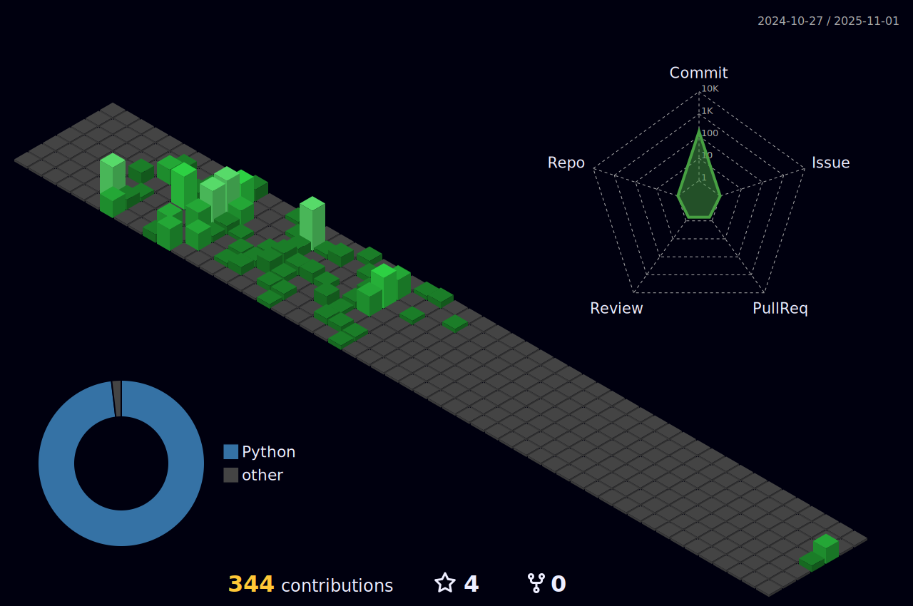

<!--  

#### 📝 Recent Project 
Since January 20th, I have been working on [this project](https://github.com/seminarNotes/engineering--smartcar-real-time-log-processing) with the Hadoop ecosystem built using Cloudera. 

#### 👋 HELLO

Thank you for visiting my GitHub page.

I am currently immersed in the study of data engineering and bring with me two years of experience as a numerical analysis developer. Beyond my focus on data engineering and quant development, I maintain a wide-ranging interest in various programming languages and theories. My goal is to discover improved solutions by exploring and mastering new technologies and tools.

I will be documenting my studies and challenges right here on my GitHub. Despite the prevalence of English among users, I've decided to primarily compose my posts in my native language, Korean. This choice is driven by my commitment to keeping my records concise and dedicating more time to the study of computer programming. If you ever find the need for English translations to understand my content, please do not hesitate to ask me for assistance.

As a developer who values opportunities for communication and sharing, I am excited about the prospect of growing and learning together. Please feel free to reach out at any time.

Best regards,  
SeminarNotes

-->

#### 📚 CONTRIBUTIONS
<!--  
 
-->

